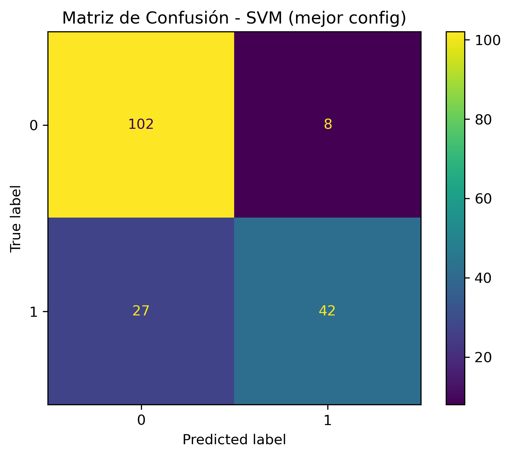
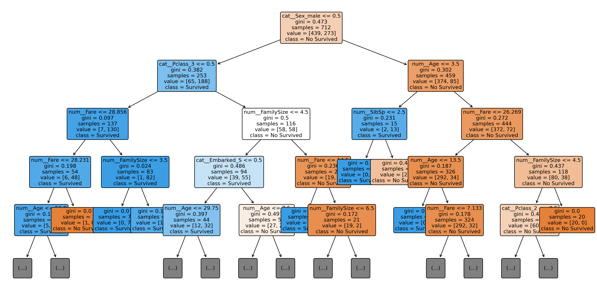

# Supervised Learning on the Titanic Dataset

This repository contains a supervised learning study using the classic Titanic dataset. The work compares several classification algorithms and evaluates their performance on a stratified train/test split using cross-validation, hyperparameter tuning and standard classification metrics.

## Contents

- `supervised_learning_titanic.ipynb`: main notebook with preprocessing, training, tuning and evaluation.
- `REPORT.pdf`: final report with the methodology, results and conclusions.
- `data/titanic.csv`: Titanic dataset used in the experiments.
- `images/`: generated figures and confusion matrices.
- `requirements.txt`: Python dependencies.

## Models Evaluated

- Support Vector Machines
- Decision Trees
- Random Forest
- Extra Trees
- Gradient Boosting
- AdaBoost

## Results Summary

The final comparison selects the optimized SVM with RBF kernel as the best global model because it achieves the highest cross-validation accuracy while keeping a strong test score and very low training time.

| Model | CV Accuracy | Test Accuracy | Precision | F1-Score |
| --- | ---: | ---: | ---: | ---: |
| SVM (RBF) | 0.8385 | 0.8045 | 0.8400 | 0.7059 |
| Decision Tree | 0.8147 | 0.7989 | 0.8511 | 0.6897 |
| Random Forest | 0.8287 | 0.8045 | 0.7931 | 0.7244 |
| Gradient Boosting | 0.8260 | 0.7877 | 0.7925 | 0.6885 |
| AdaBoost | 0.8063 | 0.7765 | 0.6986 | 0.7183 |

Key findings:

- The best global model is **SVM with RBF kernel** (`C=1`, `gamma=0.1`), with `0.8385` cross-validation accuracy and `0.8045` test accuracy.
- **Random Forest** reaches the same test accuracy and obtains the best F1-score (`0.7244`), making it a strong alternative when recall/precision balance matters.
- **Extra Trees** obtains the highest isolated test accuracy in one experiment (`0.8268`), but its lower cross-validation score makes it less stable as the final selected model.
- The most relevant predictors across the models are sex, passenger class and age.

## Visual Results

Final confusion matrix for the selected model:



Decision tree visualization:



Additional generated figures are available in the [`images/`](images/) folder.

## How to Run

Create a virtual environment, install the dependencies and open the notebook from the repository root:

```bash
pip install -r requirements.txt
jupyter notebook supervised_learning_titanic.ipynb
```

The notebook expects the dataset at `data/titanic.csv` and writes generated plots to `images/`.

## Dataset

The project uses the public Titanic passenger dataset, commonly used for machine learning classification examples. The original columns include passenger names, ticket identifiers and cabin values because they are part of the public dataset. The notebook removes high-cardinality columns such as `Name`, `Ticket`, `Cabin` and `PassengerId` during preprocessing.

## Reproducibility

The train/test split and model configurations use fixed random seeds where applicable.
